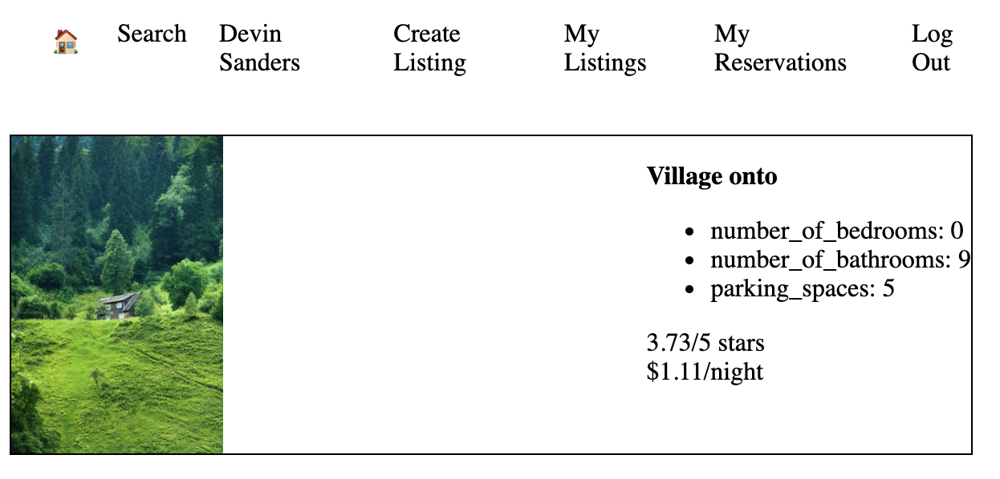
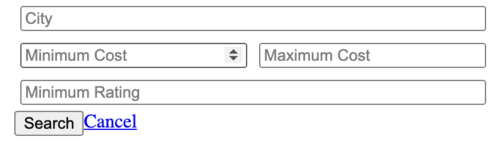
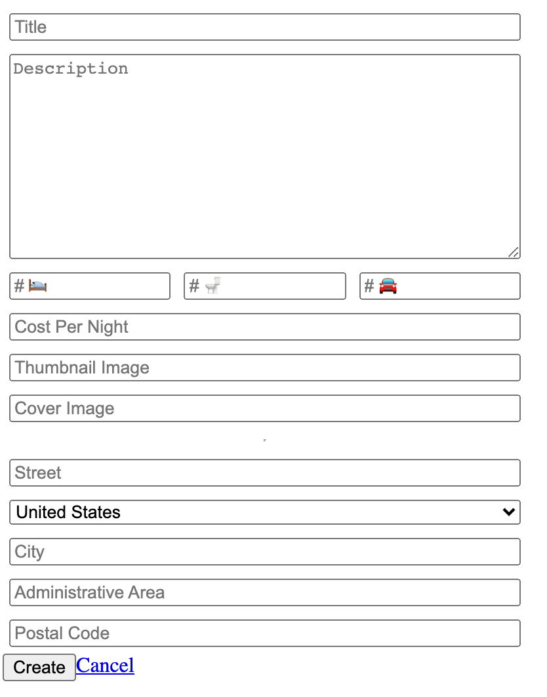
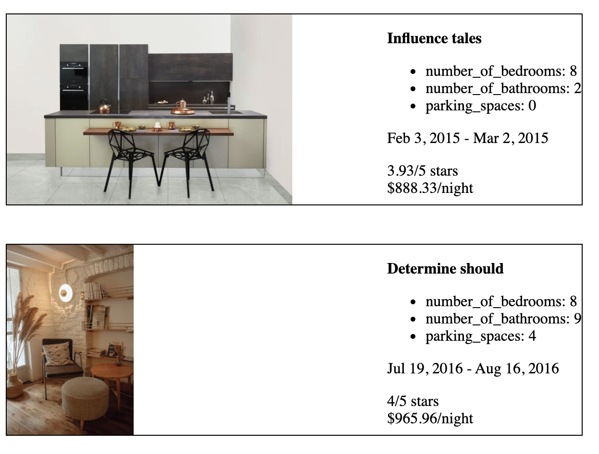

# LightBnB Project

LightBnB is a basic clone of AirBnB functionality, with a focus on using an integrated backend database to query properties.

This project demonstrates implementation of database design, with utilization of server-side JS, PostgreSQL, and Node.

## Final Product

LightBnB is a single page web application that allows users to search for properties to rent, and post new properties themselves.

 
### All Properties

Users can view all available properties, and by default, 10 properties are displayed on the main page.

### Property Search

Users can narrow their search by city, minimum and maximum costs, and minimum rating. All parameters can be modified for a single search.

### Create Listing

Users can also create a new property for rent by providing the available details of their property. This new property is added to the database on submission.

### My Reservations

Users can view their previous reservations, including the reservation duration and their ratings.

## Getting Started

1. Clone this repository onto your local device.
2. Install all dependencies using the `npm install` command.
3. Start the web server using the `npm run local` command. The app will be served at <http://localhost:3000/>.
4. Go to <http://localhost:3000/> in your browser.

## Dependencies

- Express
- Bcrypt
- Node 5.10.x or above
- Node Postgres
- Body Parser
- Cookie Session